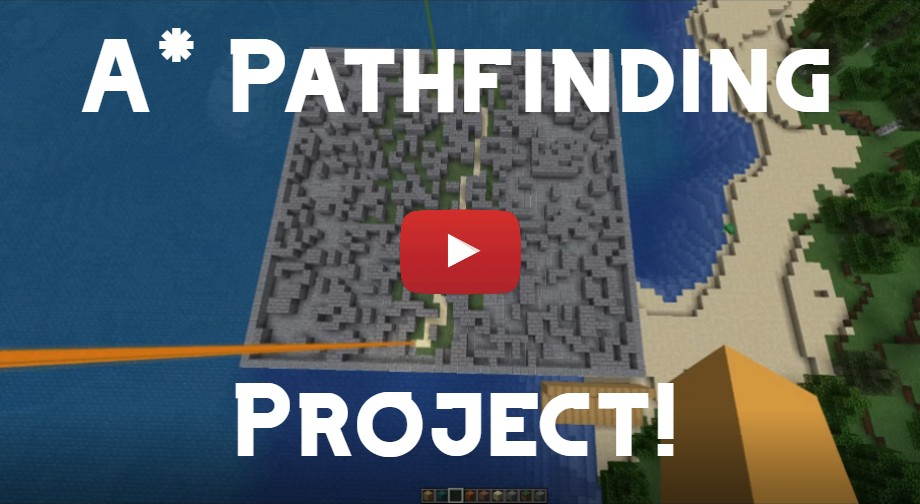

# Minecraft pathfinding plugin

#### A program that generates random mazes and solves them with AI (and other algorithms).

#### This is an implementation of the A* pathfinding algorithm (and other algorithms).

### Video

### Command
<code>/maze</code>

### More demos and walkthroughs

<b>Initializing maze example</b>

 
Creating a Maze and ControlPlatform object...
 
 
<code>/maze astar2d 30 50</code>
 
 

<b>Starting animation example</b>

 
Watching the algorithm solve the maze...
 
 

<b>Changing block types example</b>

 
Editing the block types used to create the maze and animations...
 
 

<b>Breadth-first search example</b>

 
Creating a maze object utilizing BFS...
 
 
<code>/maze bfs2d 30 40</code>
 
 

<b>Depth-first search example</b>

 
Creating a maze object utilizing DFS...
 
 
<code>/maze dfs2d 40 20</code>
 
 

### Tech stack
- Minecraft 1.18.1
- spigot 1.18.1

### Similar repositories by <a href="https://github.com/btror/AStar">btror</a>
- <a href="https://github.com/btror/AStar">AStar</a>
- <a href="https://github.com/btror/A-Star">A-Star</a>
- <a href="https://github.com/btror/TraversalAlgorithmVisualization">TraversalAlgorithmVisualization</a>
