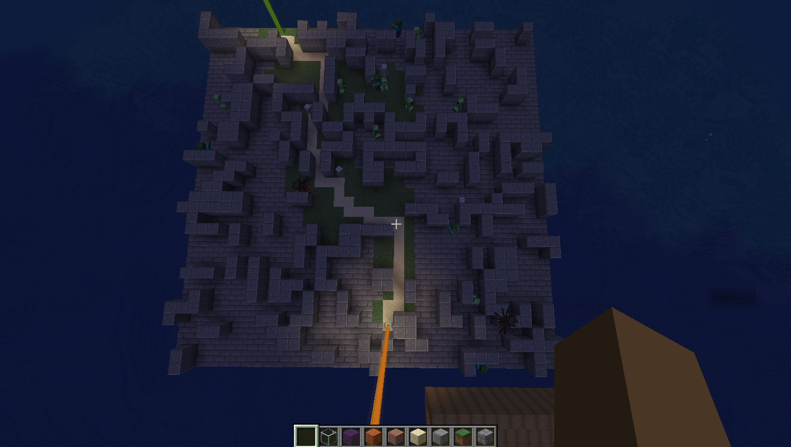
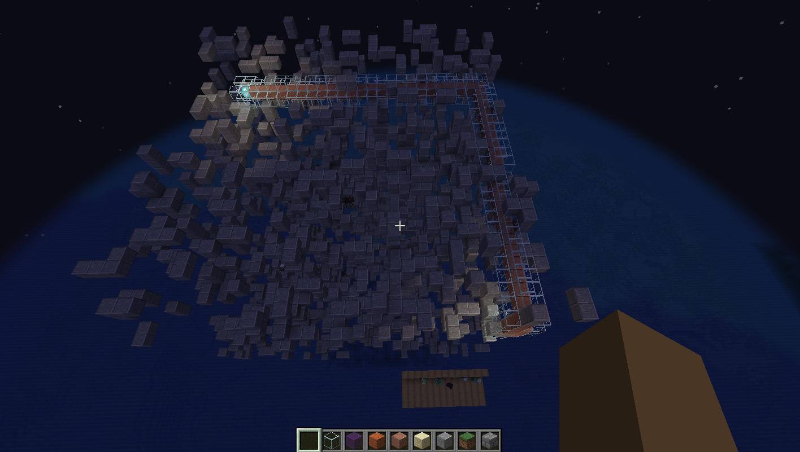

# Minecraft pathfinding plugin

#### A program that generates random mazes and solves them with AI (and other algorithms).

#### This is an implementation of the A* pathfinding algorithm (and other algorithms).

### Video

### Command
<code>/maze</code>

### Algorithms
- A*
- Greedy best-first search
- Breadth-first search
- Depth-first search

### Screenshots

<b>Control platform</b>

Manage maze attributes and characteristics with the control platform.
 

<b>A* 2D maze example</b>

View of a 2D A* maze.
 

<b>Greedy best-first search 3D maze example</b>

View of a 3D greedy best-first search maze.
 

### Tech stack
- Minecraft 1.18.1
- spigot 1.18.1

### Similar repositories by <a href="https://github.com/btror/AStar">btror</a>
- <a href="https://github.com/btror/AStar">AStar</a>
- <a href="https://github.com/btror/A-Star">A-Star</a>
- <a href="https://github.com/btror/TraversalAlgorithmVisualization">TraversalAlgorithmVisualization</a>
